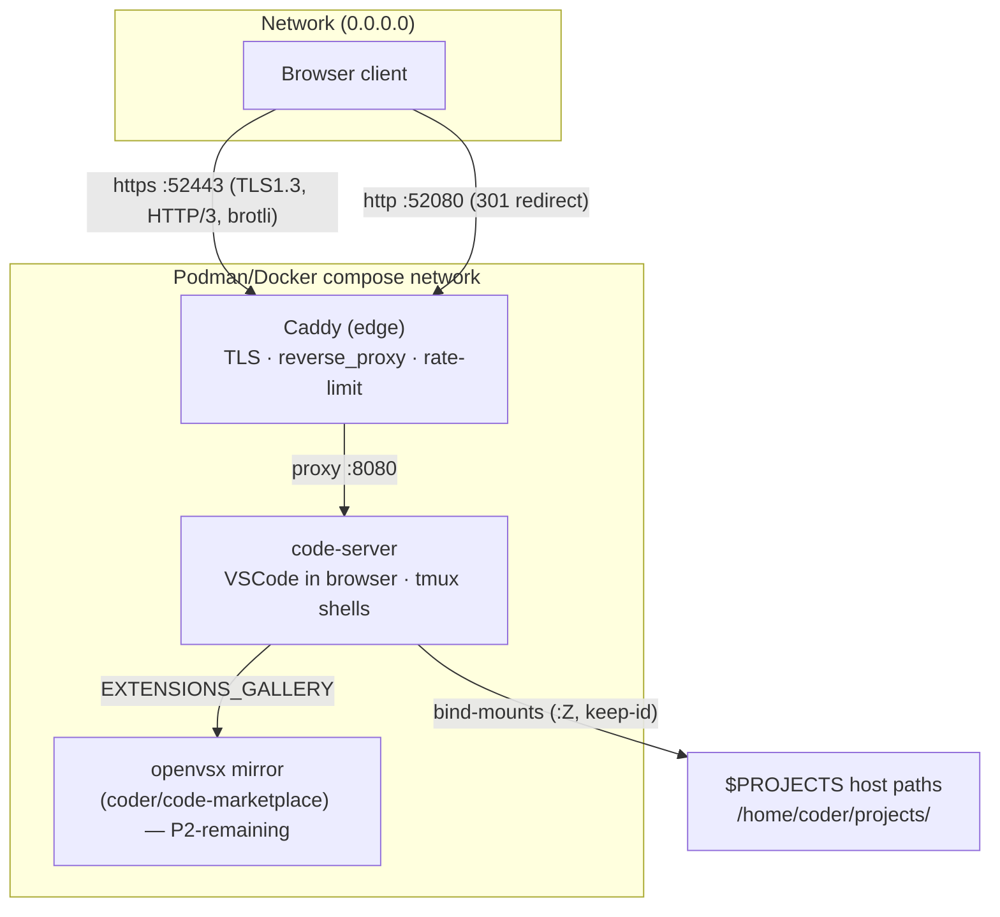
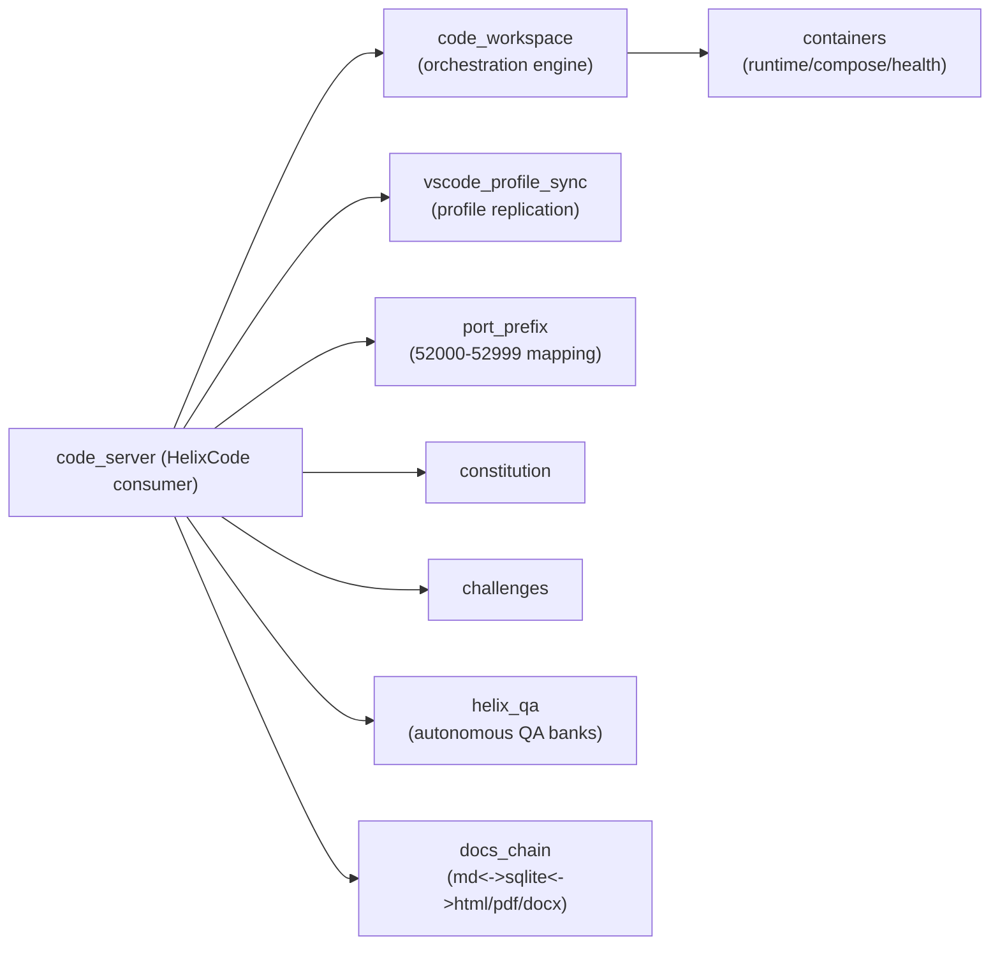
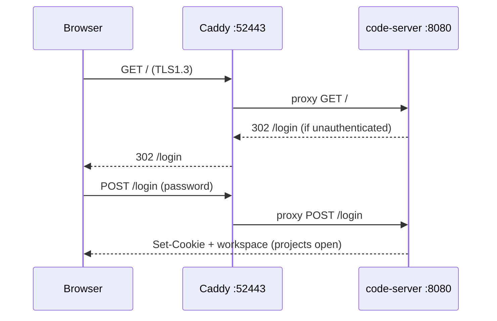
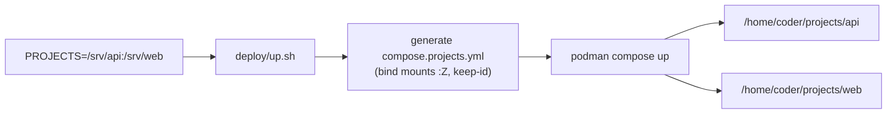
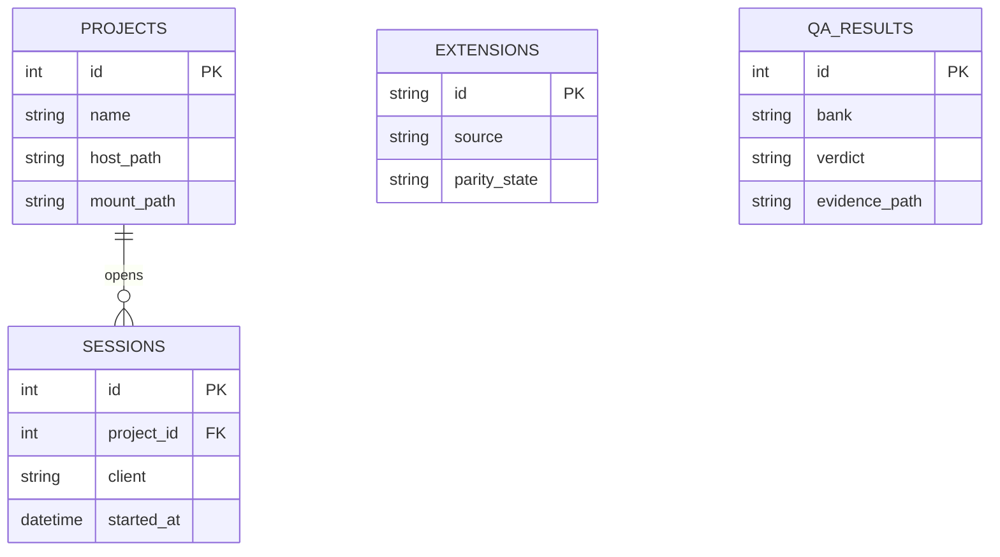

# HelixCode — Architecture

**Revision:** 1 · **Last modified:** 2026-06-30

HelixCode is a decoupled, IDE-swappable, containerized browser-IDE platform built
by composing reusable Helix/vasic-digital submodules. See the design spec
(`docs/superpowers/specs/2026-06-30-helixcode-platform-design.md`) for the full
rationale.

## Stack topology

## Reuse map (submodules)

## Request / auth flow

## Port mapping (port_prefix band 52)

| Service | Internal | Exposed (0.0.0.0) |
|---|---|---|
| Caddy HTTPS | 443 | 52443 |
| Caddy HTTP→HTTPS | 80 | 52080 |
| code-server (debug, optional) | 8080 | 52808 |
| openvsx mirror (optional external) | 3000 | 52083 |

Rule: exposed = `prefix*1000 + (internal % 1000)`, linear-probed for collisions,
guaranteed ≤ 65535. Implemented by the `port_prefix` submodule.

## $PROJECTS mount flow

## Data model (SQL — planned P5)

A SQLite catalog (bidirectionally synced to Markdown via Docs Chain):

## Verification posture (anti-bluff)

Every PASS carries captured runtime evidence; every gate is paired with a §1.1
mutation; the platform's acceptance is an autonomous HelixQA web session that a
real client drives end-to-end (open → authenticate → see replicated profile →
edit a `$PROJECTS` file → use a terminal), with screenshots/HTTP evidence.
